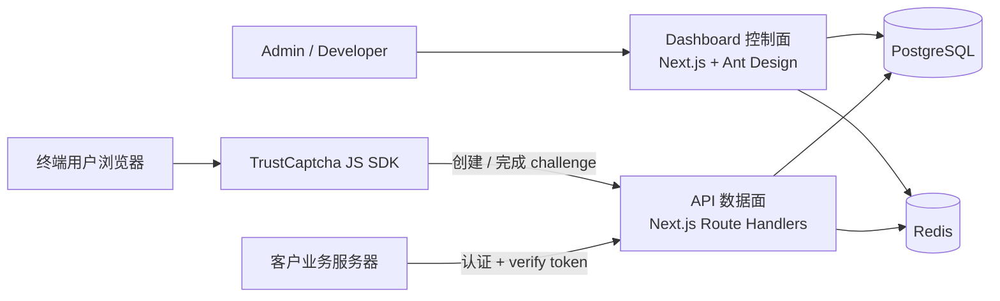
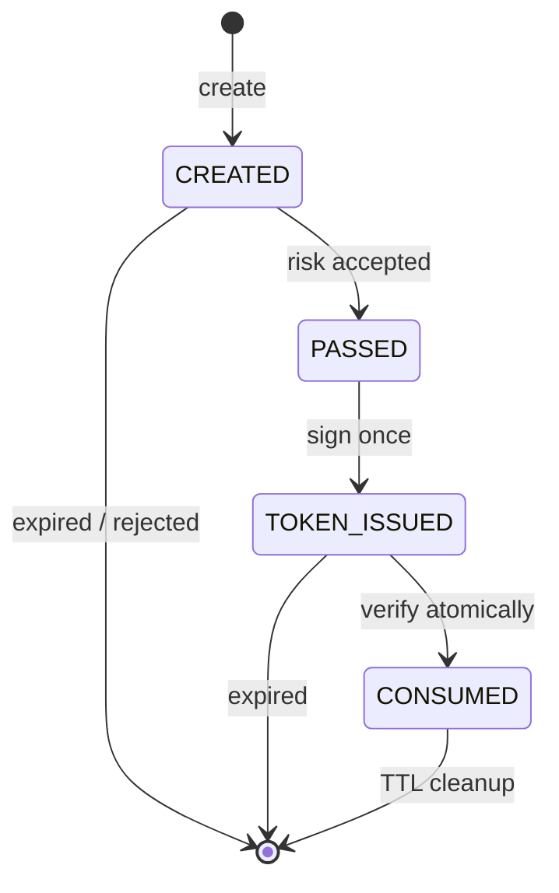
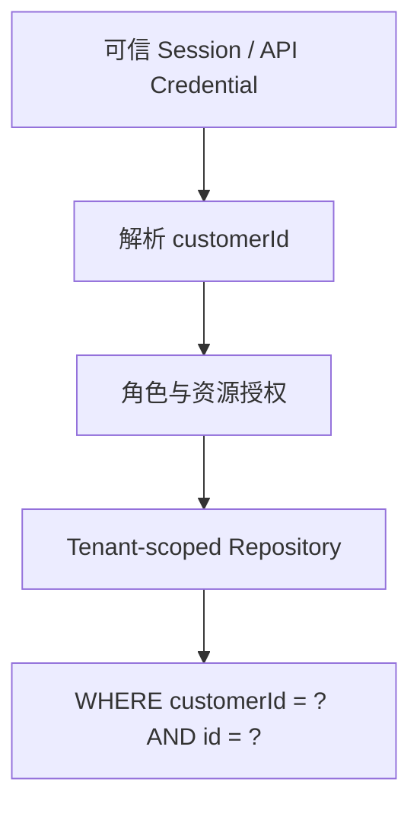

# TrustCaptcha v1 整体架构设计

> 状态：Architecture Baseline（第 1 阶段）  
> 日期：2026-08-10  
> 本文只定义架构、边界和验收标准；Prisma Schema 与实现代码留到后续阶段。

## 1. 产品目标与 v1 边界

TrustCaptcha 是面向开发者的多租户人机验证 SaaS。浏览器端展示轻量级 “I'm not a robot” 控件，成功后返回短时、不可伪造、只能消费一次的 token；客户业务服务器通过 Verify API 验证该 token。

v1 的目标是建立可上线的安全闭环，而不是证明一次点击绝对来自真人。首版依赖行为上下文和规则型风险评分，提供明确的扩展接口，后续再接入设备指纹、IP 信誉和模型推断。

### v1 包含

- Admin / Developer 登录、会话与租户内权限控制
- Dashboard 指标、趋势图、站点、API Key 和验证日志管理
- 原生 JavaScript Captcha SDK
- Challenge 创建、限时状态机与原子消费
- 规则型风险引擎
- HMAC-SHA256 签名的短时 token
- 经过认证的 Verify API、重放防护、限流与安全审计
- PostgreSQL、Redis 和 Docker Compose 本地/单机部署基线

### v1 不包含

- 图形题、短信验证、AI 模型、全量设备指纹和 IP 商业信誉库
- 跨地域 active-active、独立分析数仓、计费和套餐结算
- 企业 SSO、细粒度自定义角色和合规认证

这些能力均通过稳定接口和事件边界预留，而不在首版提前引入复杂基础设施。

## 2. 核心设计原则

1. **安全默认开启**：所有敏感服务端接口必须认证；密钥只展示一次；token 短时、绑定站点并一次性消费。
2. **控制面与数据面分离**：管理流量异常不能直接破坏验证码验证路径；未来可独立扩容。
3. **租户隔离前置**：每个持久化查询都从可信会话取得 `customerId`，不能接受客户端传入的租户身份。
4. **Redis 处理短时状态，PostgreSQL 保存事实**：Challenge、限流、重放标记放 Redis；租户配置、密钥摘要和审计日志放 PostgreSQL。
5. **核心逻辑与框架解耦**：token、风险规则和 challenge 状态机位于 packages，通过接口注入 Redis、数据库、时钟和加密实现。
6. **先模块化单体，后服务化**：v1 使用少量可部署单元和共享包，避免微服务运维成本；边界允许未来拆分。

## 3. 系统上下文



### 信任边界

- 浏览器、SDK 输入、请求头、Cookie、IP 转发头均不可信。
- `site_key` 是公开标识，不是凭证，可安全嵌入网页。
- `secret_key` 和 API Key 只能存在于客户服务端；不能进入 SDK、前端 bundle、日志或 URL。
- Dashboard Session 只能授权控制面；不能代替客户服务端 Verify 凭证。
- 只有在请求来自配置好的可信代理时才读取 `X-Forwarded-For`，否则使用直连地址。

## 4. Monorepo 规划

```text
trustcaptcha/
├── apps/
│   ├── dashboard/          # 控制面、Auth.js、管理 BFF、Ant Design UI
│   ├── api/                # 公开 challenge / complete / verify API
│   └── demo/               # 客户接入示例及服务端 verify 示例
├── packages/
│   ├── captcha-core/       # Challenge 状态机与验证编排
│   ├── token/              # token 编解码、签名、验证
│   ├── risk-engine/        # 规则、评分与 reasons
│   ├── sdk/                # 无 React 依赖的浏览器 SDK
│   ├── shared/             # DTO、Zod schema、错误码和公共类型
│   └── database/           # Prisma schema、client 与租户安全 repository
├── docs/
├── docker-compose.yml
├── pnpm-workspace.yaml
└── turbo.json
```

`database` 是在题目给出的包之外补充的基础包。将 Prisma Client 放在独立包中，可以避免 dashboard 与 api 各自生成模型、发生迁移漂移，也方便统一实现租户作用域查询。

### 应用职责

| 单元             | 职责                                                                | 不负责               |
| ---------------- | ------------------------------------------------------------------- | -------------------- |
| `apps/dashboard` | Auth.js、RBAC、站点/API Key/日志管理、统计页面、管理 Route Handlers | 签发浏览器验证 token |
| `apps/api`       | widget 配置、challenge、risk evaluate、token、verify、公开限流      | 管理员 UI、租户登录  |
| `apps/demo`      | 展示 SDK 接入及服务端 verify 的正确方式                             | 复用生产密钥         |

Dashboard 采用 BFF 模式：浏览器只访问同源的 Dashboard Route Handlers；服务端从 Auth.js Session 获取可信用户和租户，再调用共享业务包。这样既避免把数据库暴露给浏览器，也不需要在 v1 引入脆弱的跨域 Session 共享。

## 5. 领域模型

下一阶段会把以下模型落为 Prisma Schema：

- `User`：登录主体。
- `Customer`：租户/计费与数据隔离边界。
- `CustomerMember`：用户与租户关系，角色为 `ADMIN` 或 `DEVELOPER`。
- `Site`：网站配置，包含规范化 domain、公开 `siteKey`、Secret 摘要、状态。
- `ApiKey`：租户级或站点级服务端凭证，只保存摘要、前缀、末四位和生命周期状态。
- `VerificationLog`：验证事实和风险结果，保存站点、时间、IP 摘要、UA 摘要/截断值、分数、状态、原因。
- `AuditLog`：登录、站点变更、密钥创建/轮换/撤销等安全事件。
- Auth.js 所需的 `Account`、`Session`、`VerificationToken`。

所有租户资源均带不可空的 `customerId`；所有唯一约束、索引和 repository API 都显式包含租户边界。删除 Customer/Site 默认采用禁用或软删除，避免审计事实级联丢失。

## 6. Challenge 生命周期

### Redis Key

```text
challenge:{challengeId}     -> JSON/Hash，TTL 300 秒
challenge-used:{id}         -> "1"，TTL 到 token 过期
ratelimit:{dimension}:{key} -> 计数器/滑动窗口
```

Challenge 最小数据：

```ts
type ChallengeState = {
  id: string;
  siteId: string;
  status: "CREATED" | "PASSED" | "TOKEN_ISSUED" | "CONSUMED";
  createdAt: number;
  expireAt: number;
  requestNonceHash: string;
  ipHash: string;
  userAgentHash: string;
};
```

状态转换必须通过 Redis Lua 脚本原子完成，禁止 `GET` 后再 `SET` 的竞态实现。



### 浏览器验证流程

1. SDK 使用公开 `siteKey` 请求创建 challenge。
2. API 验证 Site 状态、请求 Origin 与配置 domain，并执行 IP + site 双维度限流。
3. SDK 收集最小化信号：加载到点击耗时、一次性页面 nonce、Cookie/Storage 可用性和 UA；不收集不必要的隐私数据。
4. 用户点击后 SDK 向 complete 接口提交 challenge 与信号，并锁定控件防止重复提交。
5. API 重新校验绑定信息，RiskEngine 评分；达到站点阈值后原子推进状态并签发 token。
6. SDK 只把 token 交给 callback；客户前端把它随业务表单提交到客户服务端。

仅在浏览器里隐藏算法不能构成安全边界。所有判定、状态转换和签名均在服务端完成。

## 7. Token 设计

v1 使用版本化的紧凑 token，而不是普通随机字符串：

```text
tc1.<base64url(payload)>.<base64url(HMAC-SHA256(signingInput, activeKey))>
```

Payload：

```json
{
  "cid": "challenge-id",
  "sid": "site-id",
  "iat": 0,
  "exp": 0,
  "jti": "128-bit-random-id",
  "kid": "signing-key-id"
}
```

约束：

- 默认有效期 300 秒，使用服务端单调/UTC 时钟并允许极小时间偏差。
- 签名比较必须 constant-time；解析前限制 token 总长度和 payload 大小。
- `kid` 支持全局签名密钥平滑轮换；旧 key 只验证到最长 token TTL 结束。
- token 必须同时通过签名、`exp/iat`、site 绑定、challenge 状态和 `jti` 未消费检查。
- 完成验证时以 Lua 原子写入消费标记并推进 challenge；并发请求最多一个成功。
- 日志只记录 token 指纹（例如 SHA-256 前 12 字节），永不记录完整 token。

HMAC token 只能证明由 TrustCaptcha 签发，不能单独阻止重放，所以 Redis 原子消费记录是必需组成部分。

## 8. API 设计

所有请求/响应使用 `packages/shared` 中的 Zod schema；统一返回可机器处理的错误码和 `requestId`。生产环境响应不包含堆栈。

### 公开浏览器接口

| Method | Path                                | 用途               | 关键保护                         |
| ------ | ----------------------------------- | ------------------ | -------------------------------- |
| `GET`  | `/api/v1/widget/config?siteKey=...` | 获取非敏感站点配置 | Origin/domain、缓存、限流        |
| `POST` | `/api/v1/challenges`                | 创建 challenge     | Zod、Origin/domain、IP/site 限流 |
| `POST` | `/api/v1/challenges/:id/complete`   | 评分并签发 token   | 绑定校验、原子状态转换、限流     |

浏览器接口的 CORS 只允许该 Site 配置的精确 Origin。Domain 入库前做 IDNA/小写/端口规范化；不使用可被绕过的字符串后缀匹配。

### 服务端 Verify API

```http
POST /api/v1/verify
Authorization: Bearer <site_secret_or_api_key>
Content-Type: application/json

{"token":"tc1...."}
```

成功响应：

```json
{
  "success": true,
  "score": 95,
  "expire": 300
}
```

`POST /api/v1/verify` 的 body 保持题目要求，只包含 token，但必须通过 `Authorization` 认证。不认证的 verify 会允许攻击者抢先消费窃取到的 token，造成拒绝服务；凭证对应的 Site/Customer 必须与 token 的 `sid` 一致。

业务型失败（过期、重复、site 不匹配）使用稳定 JSON 结果并提供 `errorCodes`；认证失败、限流和非法媒体类型分别使用合适的 401/429/415。接口响应不可泄露密钥是否存在等枚举信息。

## 9. RiskEngine

稳定接口：

```ts
interface RiskEngine {
  evaluate(context: RiskContext): Promise<{
    score: number; // 0 = 高风险，100 = 高可信
    reasons: string[]; // 稳定枚举值，不暴露完整规则细节
  }>;
}
```

v1 规则及建议权重：

| 规则           | 信号                         | 影响示例             |
| -------------- | ---------------------------- | -------------------- |
| IP 请求频率    | IP/site 窗口计数             | 高频扣 10–40         |
| User-Agent     | 缺失、异常长度、明显自动化   | 扣 5–25              |
| Cookie/Storage | 一致的一次性会话信号         | 加 5；缺失不直接拒绝 |
| Session        | challenge nonce 与上下文绑定 | 不一致直接拒绝或重扣 |
| 验证耗时       | 过快、超时、异常固定模式     | 扣 5–30              |

初始分数 100，经可配置规则扣分并裁剪到 0–100。默认通过阈值建议 60；真正阈值应保存于 Site 配置。硬性安全失败（签名、Origin、状态或 nonce 不一致）不进入“靠分数放行”的路径。

引擎返回稳定原因枚举，例如 `RATE_HIGH`、`UA_MISSING`、`TOO_FAST`，而管理端显示友好文案。接口为未来异步 IP Reputation、Fingerprint Provider 和模型评分器预留 adapter，但默认失败策略必须显式配置；外部信誉服务故障不能静默把所有请求判为可信。

## 10. 认证、授权与密钥

### Dashboard

- Auth.js 使用数据库 Session；Cookie 设置 `HttpOnly`、`Secure`、`SameSite=Lax`。
- 登录和敏感操作加入 CSRF 保护、速率限制和 AuditLog。
- `ADMIN`：成员、站点、密钥、日志和租户设置全权限。
- `DEVELOPER`：查看指标/日志，管理站点；默认不能管理成员或查看/轮换租户级凭证。
- 每个管理 Route Handler 先认证，再从 Session 中解析 active customer，最后执行资源级授权。

### Secret 与 API Key

- 格式包含类型和公开 key id，例如 `tc_sk_<keyId>_<randomSecret>`；数据库按 key id 定位记录。
- 随机部分至少 256 bit，使用 CSPRNG 生成。
- 仅保存带服务器 pepper 的 Argon2id 摘要；展示字段只保留 prefix/last4。
- 明文只在创建或轮换响应中出现一次，Modal 关闭后不可恢复，只能重新生成。
- Rotate 采用短暂双 key 宽限期，旧 key 到期后撤销；所有动作写 AuditLog。

## 11. 多租户隔离



- Route Handler 不直接接受或信任 body/query 中的 `customerId`。
- Repository 方法签名强制第一个参数为 `TenantContext`。
- 缓存 key 必须包含 `customerId` 或全局不可猜且已绑定租户的内部 ID。
- 导出任务、统计聚合和日志分页同样应用租户过滤，避免“主查询隔离、聚合泄漏”。
- 后续高合规版本可增加 PostgreSQL Row Level Security；v1 先使用应用层强制作用域和集成测试。

## 12. Dashboard 信息架构

Dashboard 使用 Ant Design 5 与 ProComponents，不使用纯 Tailwind 后台界面。

- `/login`：Ant Design Form，Auth.js 登录。
- `/`：Statistic Cards；请求趋势、成功率和风险分布使用 Ant Design Charts。
- `/sites`：ProTable、ProForm、Modal/Drawer；创建、编辑、禁用/删除、一次性 Secret 展示。
- `/logs`：ProTable；搜索、时间范围、分页、详情 Drawer、CSV 导出。
- `/api-keys`：ProTable/Modal；创建、撤销与 Rotate。

Next.js App Router 下使用 Ant Design 官方 SSR registry，避免首屏样式闪烁；Server Components 负责外壳和初始鉴权，交互表格/表单与 TanStack Query 放入小型 Client Components。查询键必须包含租户和筛选条件；敏感创建响应不进入长期 Query Cache。

## 13. 日志、指标与隐私

- 每个请求生成/透传 `requestId`，结构化日志包含 route、siteId、结果、耗时和错误码。
- 默认不记录 Secret、API Key、完整 token、Cookie 或原始请求 body。
- IP 建议用带独立 pepper 的 HMAC 生成可聚合摘要；如业务确需短期原始 IP，应加密存储并设置明确保留期。
- VerificationLog 是产品分析事实；AuditLog 是不可随普通业务删除的安全事实。
- Dashboard 指标定义：
  - Total Requests：时间范围内 verify 尝试数。
  - Success Rate：成功且首次消费数 / 合法 verify 尝试数。
  - Failed Requests：未通过 verify 数。
  - Average Risk Score：存在评分的验证记录均值。
- v1 日志可同步写 PostgreSQL；当流量增长后通过 outbox/queue 异步落库，不改变核心 API 合约。

## 14. Rate Limit 策略

使用 Redis Lua 实现原子固定窗或滑动窗，返回标准 `Retry-After`：

- Challenge create：按 IP、site、IP+site 三维限制。
- Challenge complete：按 challenge、IP 和 site 限制。
- Verify：按 credential、site 和来源 IP 限制。
- Dashboard login：按 IP + 账号标识限制。
- 管理写操作：按 user + customer 限制。

Redis 不可用时采用显式策略：签发/消费 token 的路径默认 fail closed；只读 Dashboard 可降级；安全事件必须告警。不能回退到单实例内存计数，因为多副本会产生不一致安全边界。

## 15. 部署拓扑

Docker Compose 的 v1 服务：

```text
dashboard  -> PostgreSQL, Redis
api        -> PostgreSQL, Redis
demo       -> api
postgres   -> persistent volume + healthcheck
redis      -> authentication + AOF + healthcheck
```

生产入口由反向代理/托管平台提供 TLS、请求体大小限制和可信代理头清洗。Dashboard 与 API 使用不同域名更利于隔离，例如 `app.example.com` 与 `api.example.com`；SDK 使用带内容哈希的静态资源并设置长缓存。

部署时必须注入并轮换：数据库 URL、Redis URL、Auth.js secret、token signing key ring、密钥 pepper、IP hash pepper。任何 secret 不写入镜像、Compose 文件或 Git。

### 可扩展路径

- API 服务无本地状态，可水平扩展；Redis/PostgreSQL 是一致性来源。
- RiskEngine provider 化后可独立为低延迟服务。
- VerificationLog 可经 outbox 投递到队列和分析仓库。
- 按 Customer/Site 分片前，保持 ID 全局唯一且事件包含租户键。

## 16. 主要威胁与控制

| 威胁               | v1 控制                                           |
| ------------------ | ------------------------------------------------- |
| 伪造 token         | HMAC-SHA256、`kid`、constant-time compare         |
| 重放 token         | `jti` + challenge Redis 原子一次性消费            |
| 抢先消费 token     | Verify 必须服务端凭证认证并校验 site 绑定         |
| Challenge 暴力请求 | 多维 Redis 限流、TTL、Origin/domain 检查          |
| Secret 数据库泄露  | Argon2id + pepper 摘要、明文只显示一次            |
| 租户越权           | Session 派生 tenant、scoped repository、集成测试  |
| 日志泄密           | 结构化白名单、token/IP 指纹、字段截断             |
| Header/IP 欺骗     | 仅信任已配置代理、规范化地址                      |
| XSS/供应链         | CSP、SRI/版本化 SDK、锁文件、依赖审计             |
| CSRF               | SameSite Cookie、Auth.js 保护、写接口 Origin 校验 |
| 并发竞态           | Redis Lua 原子状态转换与消费                      |

## 17. 错误模型与兼容策略

- API 路径带 `/v1`；公开 DTO 只能向后兼容增加可选字段。
- 标准错误结构：`{ success: false, errorCodes: string[], requestId: string }`。
- SDK 公开全局仅为 `TrustCaptcha`，`render` 返回 widget handle，支持 `reset`/`destroy`，重复 render 不重复绑定事件。
- SDK callback 最多触发一次；网络重试必须带幂等标识，但 complete 不可因此签发多个 token。
- 时间、随机数、哈希、Redis 和数据库均通过 adapter 注入，核心包可以做确定性单元测试。

## 18. 测试策略

### 单元测试

- token：篡改、过期、未来时间、未知 `kid`、错误 site、长度攻击。
- risk-engine：每条规则边界、权重叠加、分数裁剪、稳定 reasons。
- captcha-core：合法/非法状态转换和幂等行为。
- shared：所有 Zod schema 的有效与恶意输入。

### 集成测试

- 使用真实 PostgreSQL/Redis 测试 challenge TTL、Lua 原子消费和限流。
- 两个并发 verify 对同一 token 断言仅一个成功。
- 两个 Customer 使用相同资源 ID 猜测/筛选时不能读取对方数据。
- key rotate 宽限期与撤销生效。

### 端到端测试

- Demo 加载 SDK、点击、回调、业务服务端 verify 完整链路。
- Dashboard 的登录、创建 Site、Secret 单次展示、日志筛选与导出。
- Origin 不匹配、Secret 错误、token 过期/重放和 Redis 故障路径。

### 安全验证

- Zod fuzz/property tests、依赖审计、secret scanning。
- CSP/CORS/安全响应头检查。
- 越权用例矩阵和高并发重放测试。

## 19. 分阶段交付与阶段门

1. **整体架构设计**：本文评审通过。
2. **Prisma Schema**：模型、索引、删除策略、种子与迁移检查通过。
3. **初始化 Monorepo**：pnpm/Turborepo、lint、typecheck、test、build 通过。
4. **认证系统**：Auth.js、角色和跨租户拒绝测试通过。
5. **Dashboard Layout**：Ant Design SSR、菜单、权限路由和响应式布局通过。
6. **Site 管理**：CRUD、域名规范化、Secret 单次展示和审计通过。
7. **Challenge Service**：Redis TTL、状态机和并发测试通过。
8. **Token Service**：签名、轮换、过期、篡改与重放单测通过。
9. **Verify API**：认证、site 绑定、原子消费、限流和错误合约通过。
10. **JS SDK**：原生 JS、异步加载、重复提交防护和 Demo 链路通过。
11. **日志系统**：安全日志、查询、分页、导出和指标定义通过。
12. **Docker 部署**：健康检查、迁移、持久化和冷启动 smoke test 通过。

每个阶段只在其阶段门通过后进入下一步，且交付说明必须列出文件变化、设计原因和测试命令。

## 20. 本阶段架构验收清单

- [x] 定义控制面、数据面和各应用职责。
- [x] 定义租户、站点、密钥、验证与审计领域边界。
- [x] 定义 Challenge 状态机、TTL 和原子消费原则。
- [x] 定义签名 token、密钥轮换、过期和重放防护。
- [x] 修正 Verify API 的服务端认证要求。
- [x] 定义 v1 RiskEngine 规则与未来扩展接口。
- [x] 定义 Dashboard 技术落点和 Ant Design 组件要求。
- [x] 定义部署、可观测性、隐私和测试策略。
- [ ] 产品方确认 Verify 认证方式、默认评分阈值和日志保留期。

## 21. 进入第 2 阶段前的默认决策

若无额外产品要求，第 2 阶段按以下默认值设计 Prisma Schema：

- Verify 使用 `Authorization: Bearer <site_secret_or_api_key>`。
- token TTL 为 300 秒，默认风险通过阈值为 60。
- 原始 Secret/API Key 永不持久化，采用 Argon2id + 环境 pepper。
- VerificationLog 默认保留 30 天，AuditLog 默认保留 180 天；先在应用层执行保留策略。
- Site “删除”实现为禁用/软删除；日志与审计记录不级联删除。
