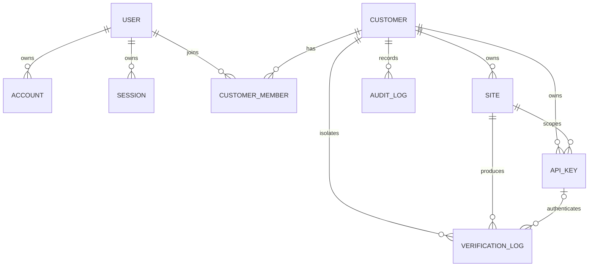

# TrustCaptcha v1 Prisma Schema 说明

> 阶段：2 / 12  
> Schema：`packages/database/prisma/schema.prisma`

## 本阶段文件变化

- 新增 Prisma 7 / PostgreSQL schema。
- 新增 Auth.js 数据库 Session 所需的 User、Account、Session、VerificationToken 和 Authenticator 模型。
- 新增多租户业务模型 Customer、CustomerMember、Site、ApiKey、VerificationLog 和 AuditLog。
- 本阶段不创建迁移、不生成 Prisma Client，也不实现 repository；这些由 Monorepo 初始化阶段接入依赖后完成。

## 设计原因

### 租户隔离

Customer 是硬隔离边界。Site、ApiKey、VerificationLog、AuditLog 均直接带 `customerId`，避免只能通过多层 join 才判断归属。业务代码必须从可信 Session/API Key 构造 TenantContext，并在查询中同时使用 `customerId` 和资源 ID。

CustomerMember 使用 `(customerId, userId)` 唯一约束，使同一用户能加入多个 Customer，但在单个 Customer 中只有一个 Admin/Developer 角色。

### Secret 与 API Key

Site Secret 和 API Key 分成公开定位部分 `keyId` 与秘密随机部分。数据库仅保存：

- Argon2id 摘要 `secretHash`
- 可展示的 `prefix`
- 可辨识的 `lastFour`
- 生命周期字段

明文不会进入数据库。ApiKey 通过自关联记录 rotate 链，旧 key 可在短暂宽限期后撤销。

### 验证日志与隐私

VerificationLog 同时保存加密 IP 和 HMAC IP 摘要：前者仅供有权限的日志页面解密展示，后者用于聚合和风险检测。User-Agent 截断到 512 字符并另存摘要；完整 token 永不保存，只保存短 token 指纹。

日志的常用过滤组合均带 Customer 前缀索引；大体量按时间追加的日志另有 BRIN 索引，以较小空间支持保留期清理和时间扫描。

### 删除策略

- User、Customer、Site 使用状态与 `deletedAt` 软删除。
- 活跃 Site 的 `(customerId, domain)` 使用 PostgreSQL partial unique index；删除后允许未来重新注册域名。
- 审计与验证事实使用 `onDelete: Restrict`，不能被普通级联删除破坏。
- Auth.js Account/Session/Authenticator 是认证附属数据，允许在 User 真正物理删除时级联清理。

### Prisma 版本基线

采用 Prisma 7 的 `prisma-client` generator 和显式 output；连接串将在第 3 阶段通过 `prisma.config.ts` 注入，不写入 schema。使用 `partialIndexes` preview feature 表达活跃域名唯一约束。

## 关系概览



## 数据库外的不变量

Prisma Schema 无法完整表达以下约束，必须在 service/repository 与测试中保证：

- `Site.riskThreshold` 必须在 0–100；`tokenTtlSeconds` 必须在允许范围内。
- ApiKey 的 `siteId` 若非空，Site 必须属于同一个 `customerId`。
- VerificationLog 的 Customer、Site 与 ApiKey 必须属于同一租户。
- `actorType` 与 actor ID 必须匹配；SYSTEM 不应带用户/API Key actor。
- `SUCCESS` 日志必须有 score；进入风险引擎前失败的日志可以没有 score。
- Secret 摘要必须由 Argon2id 加服务器 pepper 生成，IP hash 使用独立 pepper。
- `AuditLog` 只允许插入，产品代码不得更新或删除。

这些不变量将在第 3 阶段通过初始 SQL migration 中的 CHECK/触发器和第 4–11 阶段的 service 集成测试逐步固化。

## 本阶段测试方法

依赖初始化后必须执行：

```powershell
pnpm --filter @trustcaptcha/database prisma format --check
pnpm --filter @trustcaptcha/database prisma validate
pnpm --filter @trustcaptcha/database prisma generate
```

第 3 阶段还会用临时 PostgreSQL 执行 migration，并检查：

1. 活跃站点域名在同租户不可重复，软删除后可复用。
2. 跨租户外键组合由 repository/数据库约束拒绝。
3. AuditLog/VerificationLog 不会随 Site 或 Customer 级联删除。
4. 日志筛选的核心索引存在。
