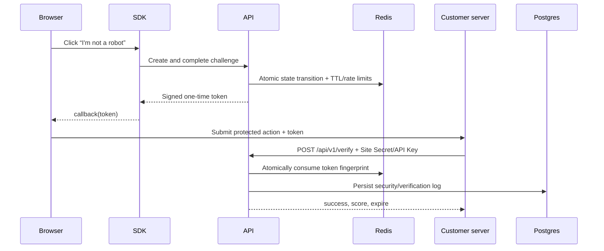

# TrustCaptcha

TrustCaptcha is a multi-tenant, developer-first human-verification SaaS. It provides a framework-free checkbox widget, signed one-time tokens, a server-side Verify API, risk scoring, and an authenticated Ant Design management console.

## Local stack

The checked-in Docker Compose stack intentionally starts above the occupied 3000–3004 range:

| Service          | URL                   |
| ---------------- | --------------------- |
| Dashboard        | http://localhost:4301 |
| Public API / SDK | http://localhost:4302 |
| Integration demo | http://localhost:4303 |

Start the complete stack:

```powershell
docker compose up -d --build
docker compose ps
```

The local seed account is:

- Email: `admin@trustcaptcha.local`
- Password: `TrustCaptcha-Local-Admin-2026!`

These values and all Compose secrets are development-only. Replace them before any shared or public deployment.

## Workspace

- `apps/dashboard` — Auth.js SaaS control plane using Ant Design and ProComponents
- `apps/api` — public challenge, widget configuration, SDK asset, health, and Verify endpoints
- `apps/demo` — integration example that keeps the Site Secret on the server
- `packages/captcha-core` — challenge orchestration and state transitions
- `packages/token` — versioned HMAC token issue/validation
- `packages/risk-engine` — deterministic v1 risk scoring rules
- `packages/sdk` — framework-free, async browser SDK
- `packages/shared` — Zod DTOs and common types
- `packages/database` — Prisma schema, migration, generated client, and idempotent seed

## Verify flow



The demo must be opened as `http://localhost:4303`. The seeded Site allowlist intentionally rejects `127.0.0.1` as a different origin.

## Local development

Prerequisites: Node.js 22+, pnpm 10+, PostgreSQL, and Redis.

Copy `.env.example` to `.env`, replace every placeholder, then run:

```powershell
pnpm install
pnpm db:validate
pnpm typecheck
pnpm test
pnpm lint
pnpm build
```

## Documentation

- [Architecture](Docs/architecture.md)
- [Database schema](Docs/database-schema.md)
- [Authentication and RBAC](Docs/authentication.md)
- [Dashboard layout](Docs/dashboard-layout.md)
- [Site management](Docs/site-management.md)
- [Challenge and risk engine](Docs/challenge-and-risk.md)
- [Token and Verify API](Docs/token-and-verify.md)
- [SDK and demo](Docs/sdk-and-demo.md)
- [Logging and API keys](Docs/logging-and-api-keys.md)
- [Deployment and operations](Docs/deployment.md)
- [Gitea Actions CI/CD](Docs/gitea-ci.md)
